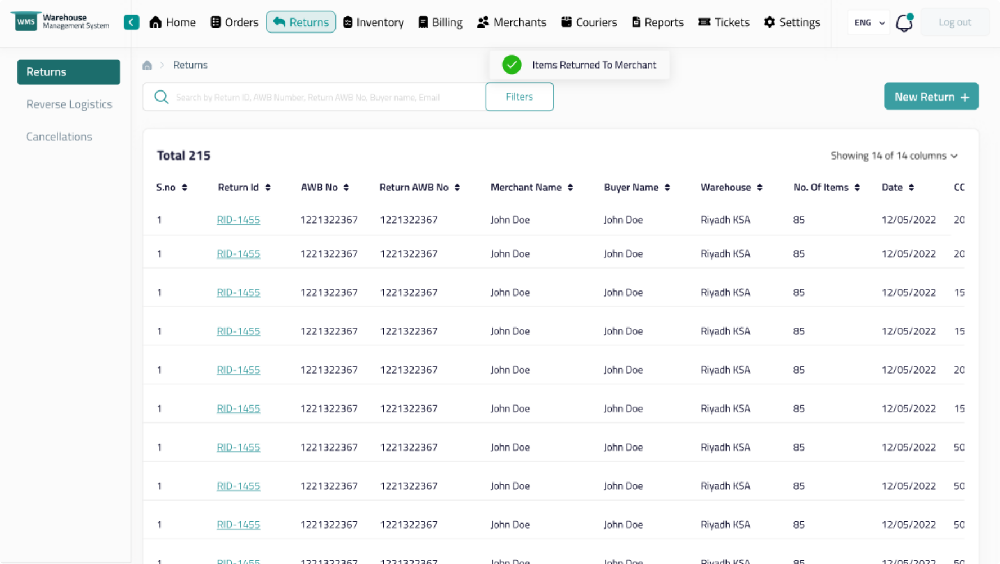
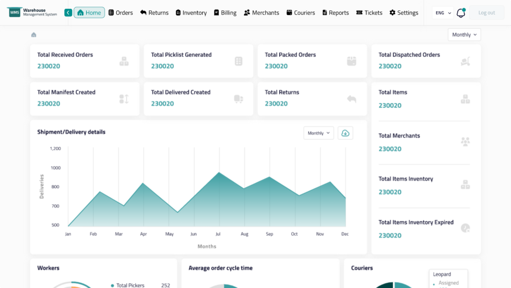
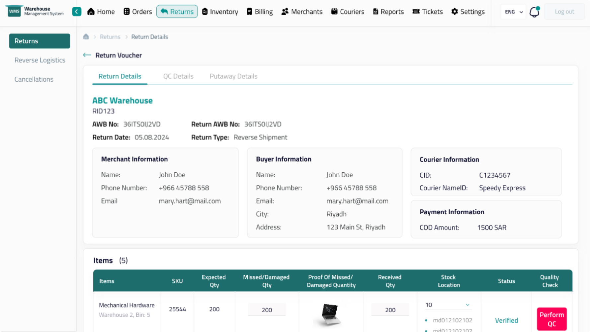
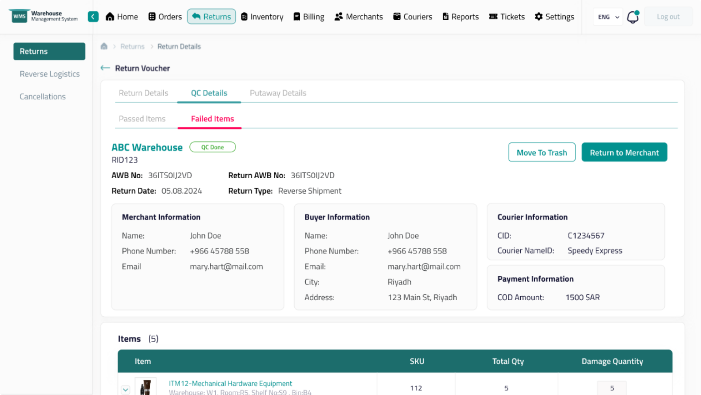

# SwiftSuite-WMS

INTRODUCTION

Translation Management System is a comprehensive software solution designed to streamline and optimize the translation process. It encompasses a range of tools and functionalities aimed at facilitating the management of translation workflows, ensuring consistency, and maximizing efficiency. From managing translation projects and organizing linguistic assets to facilitating collaboration among translators and automating repetitive tasks, a TMS acts as a central hub for all translation-related activities.

SYSTEM FEATURES

1. Online Editor
2. AI Suggestions (wrong translations, missing translation, context issue etc)
3. Comments
4. Version History
5. AI Assistant
6. DocChat where user can ask question from AI in context of document.

TECNICALITIES/TOOLS USED

1. ASP.NET
2. ReactJS
3. OPEN AI API
4. Prompt Engineering
5. Documents Parsing

SYSTEM SCREENSHOTS

 

