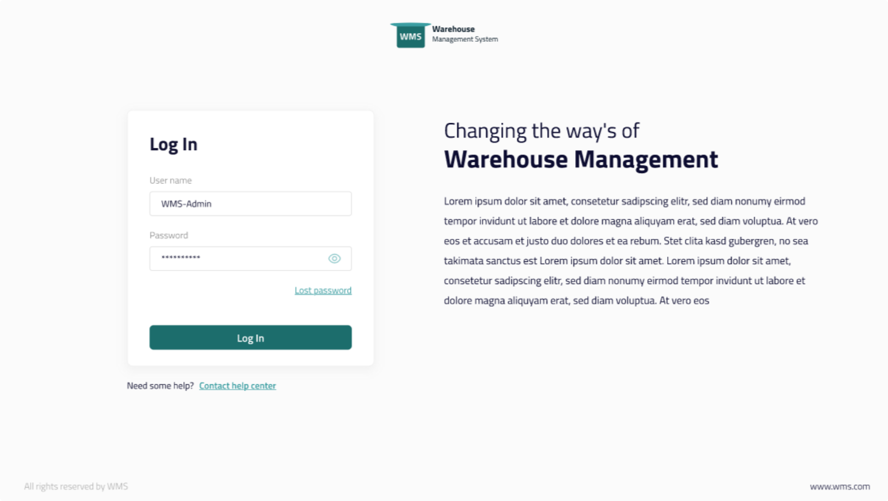

# SwiftSuite-WMS

INTRODUCTION

In the fast-paced world of e-commerce, many businesses opt to outsource their warehousing and fulfillment operations to third-party logistics (3PL) providers. To efficiently manage the order flow, track each phase of order fulfillment, and seamlessly handle inventory, a Warehouse Management System (WMS) becomes indispensable for these 3PL logistics providers. This project focuses on developing a robust WMS that integrates with courier companies, ensuring a streamlined procurement process for efficient order delivery. Tailored for the unique needs of 3PL providers, this system enhances order fulfillment, inventory management, and communication between logistics providers and their e-commerce clients.

SYSTEM FEATURES

1. Manage Inventory
2. Manage Stock
3. Order Fulfilment
4. Courier Companies Integrations
5. Clients Management
6. Return Management
7. Damages Management

TECNICALITIES/TOOLS USED

1. ASP.NET
2. ReactJS
3. SQL Database
4. 

SYSTEM SCREENSHOTS

 

